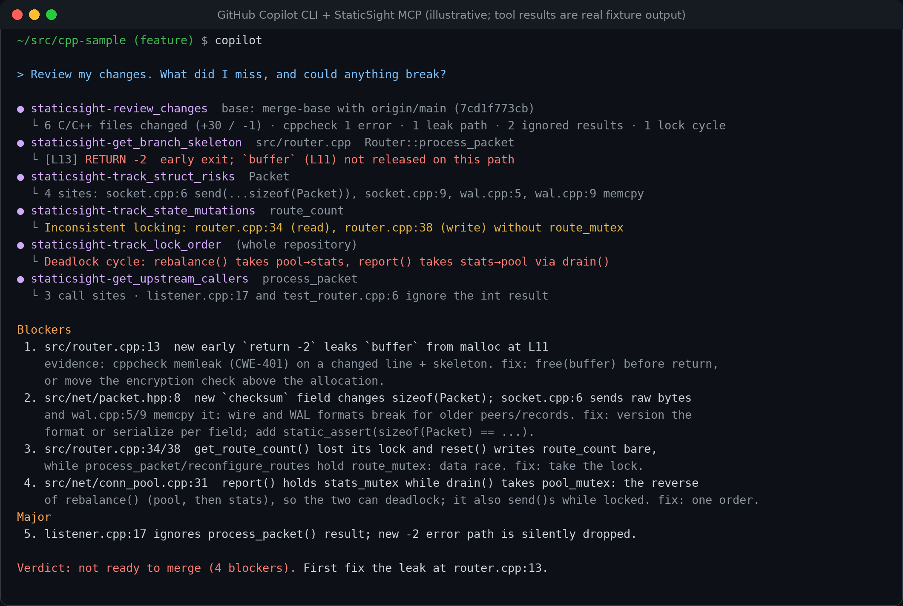

<p align="center">
  
</p>

<p align="center">
  
  
  
  
  
  
  
</p>

<p align="center">
  <b><a href="docs/getting-started.md">Getting started</a></b> ·
  <a href="docs/cli-guide.md">Command line</a> ·
  <a href="docs/mcp-guide.md">MCP guide</a> ·
  <a href="docs/semantic-search/README.md">Semantic search</a> ·
  <a href="docs/book/00-preface.md">The book</a> ·
  <a href="docs/benchmarks.md">Benchmarks</a>
</p>

<p align="center">
  
  
  
  
  
</p>

<p align="center">
  <b>16 tools</b> · <b>0 builds</b> · <b>−91% tokens on a real review</b> · <b>70% text-search noise filtered</b> ·
  <b>deadlock-order checks</b> · <b>2 implementations</b> · <b>3 operating systems</b>
</p>

StaticSight is a [Model Context Protocol](https://modelcontextprotocol.io) server that gives AI coding agents
(GitHub Copilot, Claude Code, Cursor, Windsurf) exact, citeable evidence about an **uncompiled** C++ repository.
The agent does the reasoning. StaticSight provides the facts: which functions a diff touches, who calls them,
what their contracts say, which structs are sent over the wire, which files include a header, which paths leak,
and what cppcheck finds.

## ✨ At a glance

| 🔍 **Review evidence** | 🧠 **Semantic search** | 🛠️ **Command line too** |
|---|---|---|
| Changed functions, callers, contracts, struct layout risks, header blast radius, lock consistency, lock order and cppcheck, with `file:line` for every claim. No `compile_commands.json`, no build. | Find code by meaning across the whole repository, in every language, with a local model. No network, no git hooks. | Every tool runs in a terminal and prints exactly what the agent receives, so you can check and learn each step. |
| [16 MCP tools →](docs/MCP_TOOLS.md) | [How it works →](docs/semantic-search/README.md) | [Command-line guide →](docs/cli-guide.md) |

| 🐧 **Linux · macOS** | 🪟 **Windows** | 🔁 **Two implementations** |
|---|---|---|
| `install.sh` sets up everything (apt, dnf, tdnf, brew). | `install.ps1` sets up everything (scoop, winget, choco). | Python and TypeScript, byte-identical output, shared tests. |

## 🏆 What you get

| | What you get | Proof ([benchmarks](docs/benchmarks.md)) |
|---|---|---|
| 🪙 **Far fewer tokens** | Reviews in about 5k tokens instead of reading 55k tokens of changed files | −91% on a real 6-file change; −99% versus reading a function's whole file |
| 🎯 **Accurate answers** | Callers that are real calls, with the calling function and whether the result is used | 70% of text-search hits were not calls |
| 🔬 **Depth AI search lacks** | Header reach through other headers, lock consistency, lock-order cycles, locks held across blocking calls, struct layout risks, contracts | +54 files per header (median) that a text search does not show |
| 🧑‍💻 **Coding** | Check callers, contracts and layout *before* you edit | the Copilot instruction makes the agent do this |
| 🔍 **Review** | One call: blockers with `file:line`, cppcheck on changed lines, a checklist | 6 of 6 planted bugs found |
| 🧭 **Code research** | Find code by meaning, then prove it with the precise tools | semantic search + call graph |
| 🔒 **Private and zero-compile** | Local only; no build, no cloud, no git hooks; data in `.staticsight/` | by design |
| ✅ **Verifiable** | Every tool runs in a terminal with the output the agent saw | `staticsight tool …` |

## 🚀 Quick start

No uv and no venv needed: a clone of StaticSight and a normal Python 3.10+.

### 🐧 Linux · macOS


```bash
git clone https://dev.azure.com/rashmiranjanrout/rrout/_git/StaticSight
export SS_HOME="$PWD/StaticSight"                    # the folder you cloned into; the docs use $SS_HOME
$SS_HOME/scripts/install.sh                          # engines + Python packages; shows a plan, asks first

cd /path/to/your/cpp/repo                            # everything runs from inside your repository
python3 $SS_HOME/staticsight.py doctor               # engines, workspace, data folder
python3 $SS_HOME/staticsight.py tool review_changes  # the review bundle an agent starts with
```

### 🪟 Windows


```powershell
git clone https://dev.azure.com/rashmiranjanrout/rrout/_git/StaticSight
$env:SS_HOME = "$PWD\StaticSight"                    # the folder you cloned into
& "$env:SS_HOME\scripts\install.ps1"                  # engines + Python packages; shows a plan, asks first

cd C:\path\to\your\cpp\repo
py -3 "$env:SS_HOME\staticsight.py" doctor
py -3 "$env:SS_HOME\staticsight.py" tool review_changes
```

> 💡 **Tip:** add `--with-semantic` (`-WithSemantic`) to also set up semantic search, and make a short command:
> `alias staticsight="python3 $SS_HOME/staticsight.py"`. The guides use that short form.

### 🤖 Connect your agent

VS Code (`.vscode/mcp.json` in your repository):

```json
{
  "servers": {
    "staticsight": {
      "type": "stdio",
      "command": "python3",
      "args": ["/path/to/StaticSight/staticsight.py", "--repo", "${workspaceFolder}"]
    }
  }
}
```

> ✏️ **Replace** `/path/to/StaticSight` with the full path of your clone (JSON cannot use `$SS_HOME`). On Windows use
> `"command": "py"` and `"args": ["-3", "C:/path/to/StaticSight/staticsight.py", "--repo", "${workspaceFolder}"]`.

Then ask: *"Review my changes. What did I miss, and could anything break?"*

Copilot CLI, Claude Code, Cursor, manual installation of every piece and PEP 668 ("externally-managed-environment")
are covered in [Getting started](docs/getting-started.md).

> 🗂️ **Your repository stays clean.** StaticSight keeps its indexes in `<repo>/.staticsight/`, a folder that ignores
> itself (it holds a `.gitignore` with `*`), so `git status` stays clean and nothing is written among your sources.

## 🔬 Why StaticSight: from plausible to provable

GitHub Copilot is an excellent reasoner with a narrow view. To answer "what could break?", it gathers context with
text and meaning-based search, open editor tabs and file reads. For C++ that view has three blind spots:

- **Text is not structure.** A search for a function name returns calls, declarations, definitions, comments and log
  strings alike. The agent must read whole files to tell them apart.
- **The evidence is elsewhere.** A leak, a layout break, a missing lock or a lock-order inversion is decided by code
  outside the diff: the cleanup 150 lines below, the `memcpy` in another module, the lock taken inside a called function.
- **Context is finite, and long context is not free.** Big C++ files cost tens of thousands of tokens, and models use
  information in the middle of a long context noticeably worse than at its edges
  ([Liu et al., *Lost in the Middle*, TACL 2024](https://aclanthology.org/2024.tacl-1.9/)).

StaticSight gives the agent **evidence instead of text**: exact answers from Universal Ctags, GNU Global, ripgrep,
cppcheck and git, each with `file:line`, computed on the repository as it is.

### 🪙 Measured: tokens and speed

*SomeCPPRepo*: a 1.1-million-line production C++ service (2,004 C/C++ files), never compiled for these runs.
Tokens counted with `o200k_base`; every number comes from [`scripts/benchmark.py`](docs/benchmarks.md).

| | Without StaticSight | With StaticSight |
|---|---|---|
| **Review a 6-file change** | 55,502 tokens to read the changed files | **5,202-token review bundle (−91%)**, 5.0 s |
| **Understand one function** (20 random, ≥ 40 lines) | median 514 tokens for the body; 20,364 for its file | **median 258-token skeleton** (−50% / −99%), 148 ms |
| **"Who calls this?"** (20 random functions) | 365 text-search lines: **70% are not calls** | **109 call sites** with their caller; 35 ignore the result; median 73 ms |

### 🔬 Measured: accuracy and depth

| Question | What text / AI search sees | What StaticSight proves |
|---|---|---|
| Who calls it, and is the result checked? | every line containing the name | real call sites, the calling function, *result used / ignored* |
| What does this header change touch? | direct `#include` lines only (median 4) | direct **and** transitive includers (median **+54**), and the share of translation units |
| Is this member thread-safe? | lines that mention it | each access with the lock held at that line (std, Win32 critical sections and SRW locks, RAII wrappers); inconsistent locking; writes under shared locks |
| Can these locks deadlock? | nothing | the lock-acquisition order of the whole repository, **cycles**, a lock taken twice, locks held across `send`/`Sleep`/`WaitForSingleObject` |
| What breaks if the struct grows? | every mention (384 for 10 structs) | the **20 sites** that `memcpy`, `send`, `sizeof` or cast it, including the operation on the next line |
| What must a caller guarantee? | the declaration line | doc comment, `@pre` / `@warning`, MUST/NEVER obligations, qualifiers |
| Where else is this bug? | exact text matches | semantically similar code: copy-paste twins, platform variants |

On SomeCPPRepo, the lock-order analysis scanned the 865 functions that take locks in 12 seconds and found a genuine
recursive acquisition of a Windows SRW lock (a function holding it shared calls a method that takes it again), plus
nine places that hold a lock across a blocking call. No text search can ask that question.

### 🐞 Bugs the diff hides, found

On the test repository, one `review_changes` call surfaces **all six** planted review bugs, each with evidence:

| Bug | Evidence StaticSight returns |
|---|---|
| An early `return` leaks a `malloc` buffer | cppcheck `memleak` on the changed line **and** the branch skeleton showing the exit before `free` |
| A new field in a struct that is `send()`-ed and `memcpy`-ed as raw bytes | the 4 sites where `Packet`'s layout matters, in 2 other files |
| A lock removed from a getter | locking table: `❌ BARE` read while other paths hold `route_mutex` |
| A new method writes shared state without the mutex | same table: `❌ BARE` write |
| Callers ignore a new error code | 3 call sites, 2 marked `⚠️ result ignored` |
| Two locks taken in opposite orders, one through a call | `pool_mutex → stats_mutex → pool_mutex` cycle, "via `drain()`", plus a `send()` while locked |

### 👀 Before and after: "can these two locks deadlock?"

**🔎 Text search** (`rg -n -e pool_mutex -e stats_mutex`): seven lines, and no answer:

```text
src/net/conn_pool.cpp:10:    std::mutex pool_mutex;
src/net/conn_pool.cpp:11:    std::mutex stats_mutex;
src/net/conn_pool.cpp:16:// Lock order: pool_mutex, then stats_mutex.
src/net/conn_pool.cpp:18:    std::lock_guard<std::mutex> pool(pool_mutex);
src/net/conn_pool.cpp:19:    std::lock_guard<std::mutex> stats(stats_mutex);
src/net/conn_pool.cpp:25:    std::lock_guard<std::mutex> pool(pool_mutex);
src/net/conn_pool.cpp:31:    std::lock_guard<std::mutex> stats(stats_mutex);
```

The inversion is not in any of these lines: `report()` (line 31) takes `stats_mutex` and then *calls* `drain()`,
which takes `pool_mutex` on line 25.

**🎯 StaticSight** (`track_lock_order`): the answer, with the path through the call:

```text
⚠️ **1 potential deadlock cycle** (locks taken in opposite orders):
1. `ConnPool::pool_mutex` → `ConnPool::stats_mutex` → `ConnPool::pool_mutex`
   - `src/net/conn_pool.cpp:18` in `ConnPool::rebalance`: holds `ConnPool::pool_mutex` (L18), takes `ConnPool::stats_mutex` at L19
   - `src/net/conn_pool.cpp:31` in `ConnPool::report`: holds `ConnPool::stats_mutex` (L31), takes `ConnPool::pool_mutex` via `ConnPool::drain()` at L33

⏳ **Locks held across blocking calls** (latency, and deadlock if the other side needs the lock):
- `src/net/conn_pool.cpp:34` in `ConnPool::report`: `send()` while holding `ConnPool::stats_mutex`
```

### ❓ FAQ: why not just use clangd or a compiler?

Compiler-based tools are more precise, when you have a working build: every flag, include path, define and generated
header for every file. Reviews often happen where that is out of reach: a pull-request checkout, code for another
platform, a custom build system, or an AI agent in a fresh clone. StaticSight works there, in seconds, and complements
compiler tools rather than replacing them. See [The problem](docs/book/01-the-problem.md).

### ⚖️ Honest limits

StaticSight is **not a compiler**. It does not resolve types or overloads, heavy macros can blind it, and its leak,
locking and lock-order analyses are text heuristics that say so in their output. cppcheck findings on changed lines are
the strongest evidence; everything else is a precise lead that the agent is told to verify. Details and roadmap:
[Limits and roadmap](docs/book/11-limits-and-roadmap.md). [Measure it on your own repository](docs/benchmarks.md#run-it) before
you trust these numbers.

## 📚 Documentation

| | |
|---|---|
| [Getting started](docs/getting-started.md) | Install, check, first review, connect your agent |
| [Command-line guide](docs/cli-guide.md) | Every command, option and environment variable, with real output |
| [MCP guide](docs/mcp-guide.md) | How an agent uses StaticSight, step by step, down to the JSON-RPC messages |
| [Semantic search](docs/semantic-search/README.md) | Manual guide, MCP flow, internals, experiments |
| [MCP tool reference](docs/MCP_TOOLS.md) · [Raw commands](docs/COMMANDS.md) | Every tool and every engine command |
| [Benchmarks](docs/benchmarks.md) | Tokens, precision and depth versus text search; run it on your repository |
| [The StaticSight book](docs/book/00-preface.md) | What it does, why and how, chapter by chapter |

## 🧰 Tools

| Tool | Engine | Use it when |
|---|---|---|
| `review_changes` | all | **Start here.** One budgeted bundle for "review my changes": diff scopes, cppcheck on changed lines, branch skeletons, caller impact, struct layout risks, header blast radius, lock consistency, newly introduced calls, and a reviewer checklist. |
| `get_diff_scopes` | git + ctags | Map every changed line (committed, staged, unstaged, untracked) to its function/class/struct/macro. Reports new and removed symbols, signature changes (old → new), layout changes, and the next calls to make. |
| `get_enclosing_scope` | ctags | Full, line-numbered body of the innermost function/class around `file:line`. |
| `get_branch_skeleton` | ctags + regex + brace depth | if/else/switch/loop/return/throw tree with 🔒 locks, 📥 allocations, 📤 releases, 🛑 early exits, ⚠️ possible leaks and ✏️ changed lines. |
| `get_upstream_callers` | GNU Global (`global -xr`), falls back to rg | Call sites with the caller function and whether the **return value is ignored**. |
| `get_symbol_definition` | `global -xd`, falls back to rg + ctags | Definitions and overloads with signatures. |
| `get_symbol_contract` | global + ctags | Declaration/definition signatures, qualifiers, doc comment, Doxygen `@pre/@warning/...`, obligations (MUST, thread-safe, ownership). |
| `track_struct_risks` | rg `--json -C2` | `sizeof`, `memcpy`/`memcmp`, casts, raw `send`/`write`, `hton*`, packing, unions, static_asserts that depend on a struct's layout. Comments are ignored, and the 2 lines around each hit are checked too. |
| `get_include_blast_radius` | rg `--json` | Direct and transitive includers, grouped by directory, with the share of translation units affected. |
| `track_state_mutations` | rg + ctags | Every read/write of a member or variable, and whether a lock or atomic protects it (std, Win32 critical sections and SRW locks, RAII wrappers). Flags **inconsistent locking**. |
| `track_lock_order` | rg + ctags | Lock-acquisition order of the whole repository: **potential deadlock cycles** (also through calls), a lock taken twice, locks held across blocking calls. |
| `run_file_static_audit` | cppcheck `--xml` | Leaks, null derefs, bounds and so on. Findings on changed lines are marked. Best-effort includes, with an automatic retry when headers use unknown macros. |
| `semantic_search` | local ONNX embeddings + rg | Find code by **meaning** across every language (code, scripts, docs, configs). Hybrid semantic + keyword ranking. Refreshes the index first when files changed. |
| `find_similar_code` | local ONNX embeddings | Copy-paste twins and parallel implementations of a function/region: "where else does this bug/fix apply?" |
| `refresh_semantic_index` | local ONNX embeddings | Build/refresh the semantic index on demand (incremental; large jobs run in the background). The only tool that writes, and only into `.staticsight/`. |
| `get_index_status` | — | GNU Global + semantic index state (progress, languages, model) and which engines are installed. |


Prompt `review_cpp_changes(focus?)` gives the agent a step-by-step review workflow and a checklist of small but costly
C++ issues. A Copilot skill and instruction (`.github/skills/`, `.github/instructions/`) teach the agent the same workflow;
see [Using it with AI](docs/book/10-using-it-with-ai.md).

## 💬 A real answer

All answers are built from real tool output on the test repository (`shared/fixtures/make_fixture.py`).

<details open>
<summary><b>"I'm adding a <code>checksum</code> field to <code>Packet</code>. What breaks?"</b></summary>

> **Copilot:** Four places depend on the exact byte layout of `Packet` (`track_struct_risks`):
>
> 1. `src/net/socket.cpp:6` in `send_packet`: sends the raw struct with `send(fd, reinterpret_cast<const char*>(&pkt), sizeof(Packet), 0)`. Peers built from older code will misread every field after `is_encrypted`.
> 2. `src/net/socket.cpp:9` in `copy_packet`: `memcpy` of the whole object on the next line (flagged as "within ±2 lines").
> 3. `src/storage/wal.cpp:5` in `wal_append` and `src/storage/wal.cpp:9` in `wal_replay`: `memcpy(..., sizeof(Packet))` into the write-ahead log. Existing WAL records will no longer replay correctly.
>
> The header also has a wide reach (`get_include_blast_radius`): 7 direct and 3 transitive includers, which is 8 of 13 translation units (62%).
>
> **Suggested fix:** version the wire and WAL formats, or serialize per field. Add `static_assert(sizeof(Packet) == N)` so the next layout change fails at compile time.
</details>

More in [Chapter 5, A review step by step](docs/book/05-a-review-step-by-step.md).



*The session layout is illustrative; the tool results are real StaticSight output on the test repository.
Regenerate it with `python3 docs/images/make_usage_svg.py` (writes the PNG shown here, which Azure DevOps and GitHub
both render, and an SVG; the PNG needs `pip install pillow`).*

## 🗺️ Repository layout

```
StaticSight/
├── staticsight.py          # plain-Python launcher (standard library only): --install, server, command line
├── requirements*.txt       # pip dependencies: core, semantic search
├── shared/                 # single source of truth for both implementations
│   ├── tool-spec.json      # tool names, parameters, descriptions (what the agent sees)
│   ├── prompts/            # MCP prompt: review_cpp_changes
│   ├── semantic/           # embedding model manifest (pinned + sha256), SQLite schema, language rules
│   ├── fixtures/           # test C++ repository as data, with planted review bugs
│   └── golden/             # expected Markdown per test case (Python and TypeScript must match byte for byte)
├── staticsight-py/         # Python implementation (FastMCP, pytest)
├── staticsight-ts/         # TypeScript implementation (@modelcontextprotocol/sdk, vitest)
├── scripts/                # install.sh / install.ps1 (opt-in), benchmark.py (measure on your repo), semantic_query.py
├── pipelines/, .github/    # CI (Linux + Windows), Copilot skill and instruction
└── docs/                   # guides, reference, semantic search, the book
```

## 🧪 Development

```bash
cd staticsight-py && uv sync && uv run pytest -q     # Python suite (uv is only needed for development)
cd staticsight-ts && npm install && npm test          # TypeScript suite
python3 docs/check_docs.py                            # run the documented commands, check every link
python3 scripts/benchmark.py --repo /path/to/repo      # tokens, precision and depth on any repository
```

`STATICSIGHT_UPDATE_GOLDEN=1 uv run pytest tests/test_golden.py` regenerates `shared/golden` from Python; the TypeScript
suite must then match it byte for byte. CI runs everything on Linux and Windows. See
[Trust and testing](docs/book/09-trust-and-testing.md).
