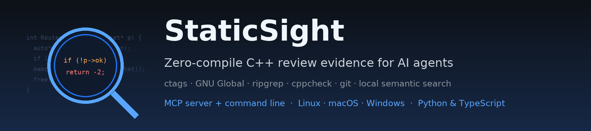

  

# StaticSight documentation

Start with the page that matches what you want to do.

| 🚀 **I want to use it** | 🤖 **I want to see how an agent uses it** | 📖 **I want to know why it works** |
|---|---|---|
| Install, check, run every command yourself. | The protocol, the tool calls, the flow inside. | The design, chapter by chapter. |
| [Getting started →](getting-started.md) | [MCP guide →](mcp-guide.md) | [The book →](book/00-preface.md) |

 
Every guide has separate 🐧 **Linux · macOS** and 🪟 **Windows** instructions where they differ.

## 🚀 Use it

| Page | What you get |
|---|---|
| 🧭 [Getting started](getting-started.md) | What to install and why, one script or by hand (🐧 / 🪟), `doctor` check, first review, connect your AI agent. |
| ⌨️ [Command-line guide](cli-guide.md) | Every command, option and environment variable, with real output. Run any of the 16 tools yourself. |
| 🧠 [Semantic search: manual guide](semantic-search/manual-guide.md) | Model download, build, search, similar code, refresh, troubleshooting. |

## 🤖 See how an agent uses it

| Page | What you get |
|---|---|
| 🔌 [MCP guide](mcp-guide.md) | Server start, handshake, tool discovery, a tool call on the wire, errors, budgets, how the agent chains tools. |
| 🔄 [Semantic search: MCP flow](semantic-search/mcp-flow.md) | Inside one `semantic_search` call: freshness check, refresh policy, ranking, answer. |
| 🧰 [MCP tool reference](MCP_TOOLS.md) | All 16 tools: parameters, method, output, limits. |
| 🛠️ [Raw commands](COMMANDS.md) | Every engine command StaticSight runs, per tool. |
| 📊 [Benchmarks](benchmarks.md) | Tokens, precision and depth versus text search, measured on a real code base; run it on yours. |

## 📖 Understand why

| Page | What you get |
|---|---|
| 📖 [The StaticSight book](book/00-preface.md) | The whole story in order: the problem, the principles, the engines, the architecture, a review step by step, each tool, semantic search, cross-platform, testing, AI integration, limits and roadmap. |
| ⚙️ [Semantic search internals](semantic-search/internals.md) | Chunking, model, hybrid ranking, storage, configuration, performance. |
| 🧪 [Learn and experiment](semantic-search/experiments.md) | A standalone script that explains every step of a search, SQL on the index, experiments to try. |

## 📝 Conventions used in these pages

> 💡 **`staticsight …`** means `python3 $SS_HOME/staticsight.py …`, where `SS_HOME` is the folder you cloned StaticSight
> into (see [Getting started](getting-started.md#5-make-a-short-command)). On Windows: `py -3 "$env:SS_HOME\staticsight.py" …`.
> The TypeScript twin, `node staticsight-ts/dist/server.js …`, accepts the same commands and prints the same output.

- 🧪 Examples run on the test repository built by `python3 shared/fixtures/make_fixture.py /tmp/cpp-sample`, so you can
  reproduce every output. Only timings and absolute paths differ on your machine.
- ✅ `docs/check_docs.py` runs the commands from the guides against that repository and checks every link and image,
  so the guides stay correct as the code changes. `docs/make_nav.py` keeps the breadcrumbs, "On this page" lines and
  previous/next links of every page in sync.
- 🖼️ Images are PNG (Azure DevOps does not render SVG in Markdown); diagrams are Mermaid, which both Azure DevOps and
  GitHub render. Regenerate images with `docs/images/make_graphics.py` and `docs/images/make_usage_svg.py`.
