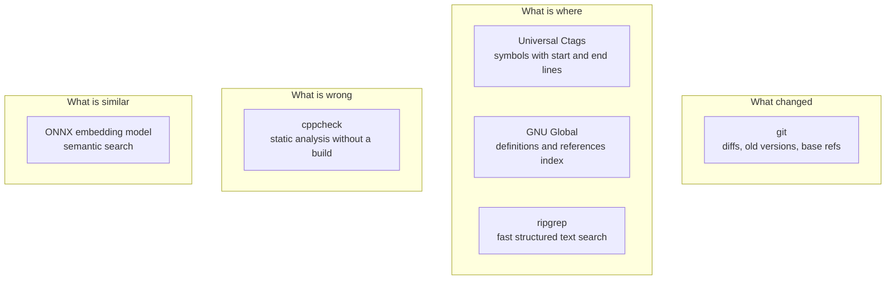

<!-- nav:top -->
📚 [Documentation](../README.md) › 📖 [The book](00-preface.md) › **Chapter 3: The engines**
<!-- /nav:top -->

# 3. The engines

StaticSight does not parse C++ itself. It stands on five mature command-line tools, each very good at one thing, and
combines their answers. This chapter introduces them in the order a review needs them, explains what each one
contributes, and shows how StaticSight talks to it. The full list of commands is in [COMMANDS.md](../COMMANDS.md).



## git: what changed

A review starts from a diff. StaticSight asks git for **everything that differs from the fork point** of your branch:
committed, staged, unstaged and untracked changes together, because a review before pushing should see all of them.

1. Find the base: `git merge-base HEAD origin/main` (falling back to `origin/master`, `main`, `master`, `HEAD`), so only
   *your* branch's changes are reviewed, not everything that happened on main since.
2. `git diff -U0 -M <base>`: zero lines of context, so each hunk header gives the exact changed line numbers;
   `-M` detects renames.
3. `git ls-files --others --exclude-standard`: new files that are not added yet count as fully added.
4. `git show <base>:<path>`: the old version of a changed file, to compare old and new symbols (what was removed, which
   signature changed).

git is the only engine whose output reaches StaticSight as a diff to be parsed; the parser reads hunk headers
(`@@ -a,b +c,d @@`) and never guesses from content.

## Universal Ctags: what is where, inside a file

[Universal Ctags](https://ctags.io) parses source files and lists their symbols: functions, methods, classes, structs,
enums, macros, members and prototypes. Two features make it the backbone of StaticSight:

- **JSON output** (`--output-format=json`), so results are parsed as data, not scraped from text.
- **End lines** (`--fields=+ne`): each symbol has a start *and* an end line. That turns "line 13" into "line 13 is
  inside `Router::process_packet`, lines 9 to 26". Almost every tool relies on it.

A typical call: `ctags --output-format=json --fields=+neKSZ --kinds-C++=+p --sort=no --language-force=C++ -f - file.cpp`.
The fields add kind names, signatures and scopes; `+p` includes prototypes (declarations in headers).

Ctags is a *parser*, not a compiler: it does not expand macros or resolve types, and code hidden in heavy macros can
confuse it. For the everyday shape of C++ (functions, classes, namespaces) it is fast and reliable, and it needs no
build.

> The older **Exuberant Ctags** (still installed by some package managers) has no JSON output. StaticSight checks
> `ctags --list-features` once and, if JSON is missing, explains how to install Universal Ctags instead of failing later.

## GNU Global: who refers to what, across the repository

[GNU Global](https://www.gnu.org/software/global/) builds a cross-reference database (files `GTAGS`, `GRTAGS`,
`GPATH`) of all definitions and references in the repository. Once built, questions like "all call sites of
`process_packet`" are answered in milliseconds:

- `global -xr -- process_packet`: every **reference**, as `name line path text`.
- `global -xd -- process_packet`: every **definition**.

Building the database takes seconds for small repositories and a few minutes for very large ones. The MCP server builds
it **in the background** after the handshake and refreshes it incrementally every five minutes, so the agent never waits.
The data lives in `<repo>/.staticsight/`, never among your sources.

GNU Global is **optional**. Without it, callers and definitions come from ripgrep plus ctags, which is slower on huge
repositories and a little less precise, and the answer says `(source: ripgrep fallback)`.

## ripgrep: finding text fast, with structure

[ripgrep](https://github.com/BurntSushi/ripgrep) (`rg`) searches files very fast, respects `.gitignore`, and can emit
**JSON** (`--json`): one object per match with the path, line number, text and submatch positions. StaticSight uses it
for every "where does this text appear" question:

| Question | ripgrep call (simplified) |
|---|---|
| Which lines touch type `Packet` (with 2 lines of context)? | `rg --json -w -F -C 2 -e Packet` |
| Which files include `packet.hpp`? | `rg --json -e '^\s*#\s*include\s*["<]([^">]*/)?packet\.hpp[">]'` |
| Every access to `route_count` | `rg --json -w -F -e route_count` |
| Which files take locks? | `rg --json -e '\b(?:lock_guard\|unique_lock\|…\|EnterCriticalSection\|AcquireSRWLock\w+)\b\|…'` |
| Call sites when GNU Global is missing | `rg --json -e '\bprocess_packet\s*\(\|&\s*(?:\w+::)*process_packet\b'` |
| All files to index | `rg --files` |

Two details matter for identical output on every OS: `--path-separator /` makes Windows paths use `/`, and
`--no-config` ignores personal ripgrep settings.

ripgrep finds text; StaticSight then filters it. A hit inside a comment or a string literal is dropped, the enclosing
function comes from ctags, and each line is classified (a call whose result is used, a `memcpy` of the struct, a write
under a lock). This combination (fast text search plus a real parser for context) is how StaticSight gets useful
precision without a compiler.

## cppcheck: what is wrong, without a build

[cppcheck](https://cppcheck.sourceforge.io) is a static analyser designed to work **without a complete build**. It
finds memory and resource leaks, null dereferences, out-of-bounds access, uninitialised variables, use after free and
more. StaticSight runs it on one file at a time:

```text
cppcheck --xml --enable=warning,style,performance,portability --inline-suppr --language=c++ --std=c++17 …
```

with best-effort include paths (the file's folder, its parents, and `include`/`inc`/`src` folders), and with
missing-include warnings suppressed, since in zero-compile mode many headers are expected to be missing. The XML
output is parsed, findings are mapped onto the diff (✏️ on a changed line, 🔶 inside a changed function) and sorted by
severity.

Two refinements make it useful on real code:
- **MSVC mode.** When a file is Windows code (`windows.h`, SAL annotations such as `_In_`, Win32 types), cppcheck gets
  `--library=windows --platform=win64`, so it knows that a `HANDLE` from `CreateFileW` must be closed.
- **Unknown-macro retry.** If headers use a macro cppcheck cannot parse, it re-runs without include paths and names the
  macro, so you can pass a definition (`STATICSIGHT_CPPCHECK_ARGS="-DMY_MACRO(x)="`).

## The embedding model: what is similar in meaning

The sixth engine is not a command but a model: `jina-embeddings-v2-base-code`, run locally with ONNX Runtime. It turns
a piece of code, or a question in plain English, into a list of 768 numbers such that similar meanings give similar
lists. That powers `semantic_search` and `find_similar_code`. It is optional, runs on the CPU, and is covered in
[Chapter 7](07-semantic-search.md).

## How StaticSight runs engines

All engines are started the same way, by one small layer (the *platform* layer, Chapter 4):

- **Located once** on `PATH` (on Windows, only real `.exe`/`.com` files), with their version recorded for `doctor`.
- **Started directly** with an argument list: no shell, nothing to inject.
- **Bounded:** a timeout per call (20 s by default, 60 s for cppcheck), stdout capped at 8 MB and stderr at 64 KB;
  a process that runs over is stopped together with its children.
- **Parsed at the boundary:** each engine has an *adapter* that turns its output into typed records (a `Tag`, an `RgLine`,
  a `Hit`, a `Finding`) with `/` paths. Tools never see raw engine output.

## Who uses what

| Tool | git | ctags | ripgrep | GNU Global | cppcheck |
|---|---|---|---|---|---|
| `review_changes` | ✔ | ✔ | ✔ | ✔ | ✔ |
| `get_diff_scopes` | ✔ | ✔ | | | |
| `get_enclosing_scope` | | ✔ | | | |
| `get_branch_skeleton` | markers | ✔ | | | |
| `get_upstream_callers` | | ✔ | ✔ | ✔ | |
| `get_symbol_definition` | | ✔ | ✔ | ✔ | |
| `get_symbol_contract` | | ✔ | ✔ | ✔ | |
| `track_struct_risks` | | ✔ | ✔ | | |
| `get_include_blast_radius` | | | ✔ | | |
| `track_state_mutations` | | ✔ | ✔ | | |
| `track_lock_order` | | ✔ | ✔ | | |
| `run_file_static_audit` | markers | ✔ | | | ✔ |

---

<!-- nav:bottom -->
| ⬅️ [Principles](02-principles.md) | 📚 [Documentation](../README.md) | [Architecture](04-architecture.md) ➡️ |
|:---|:---:|---:|
<!-- /nav:bottom -->
