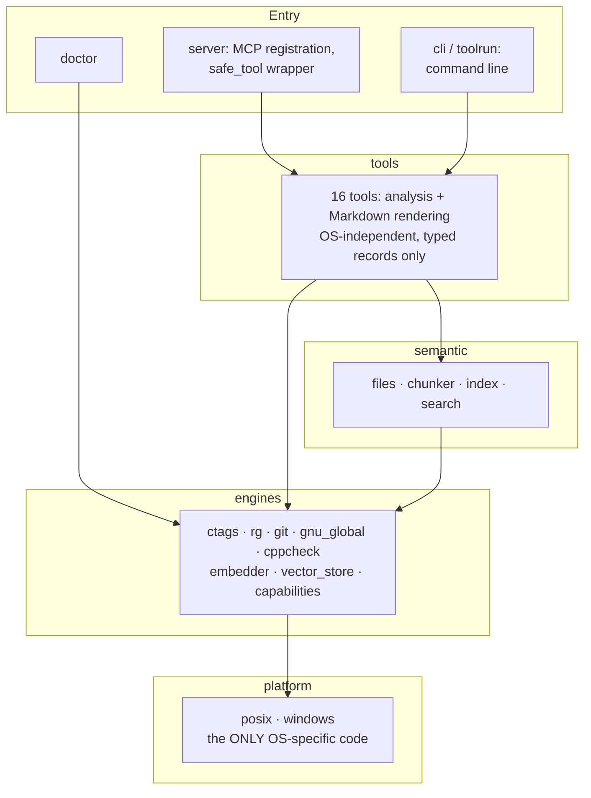
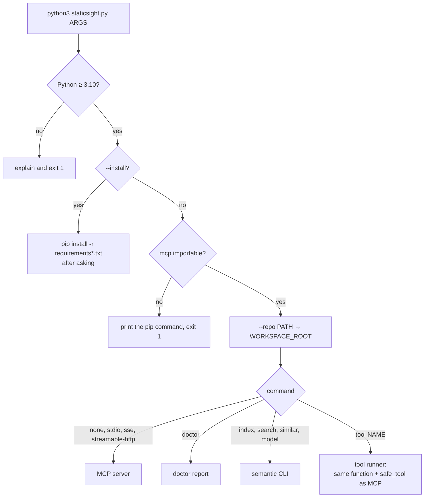
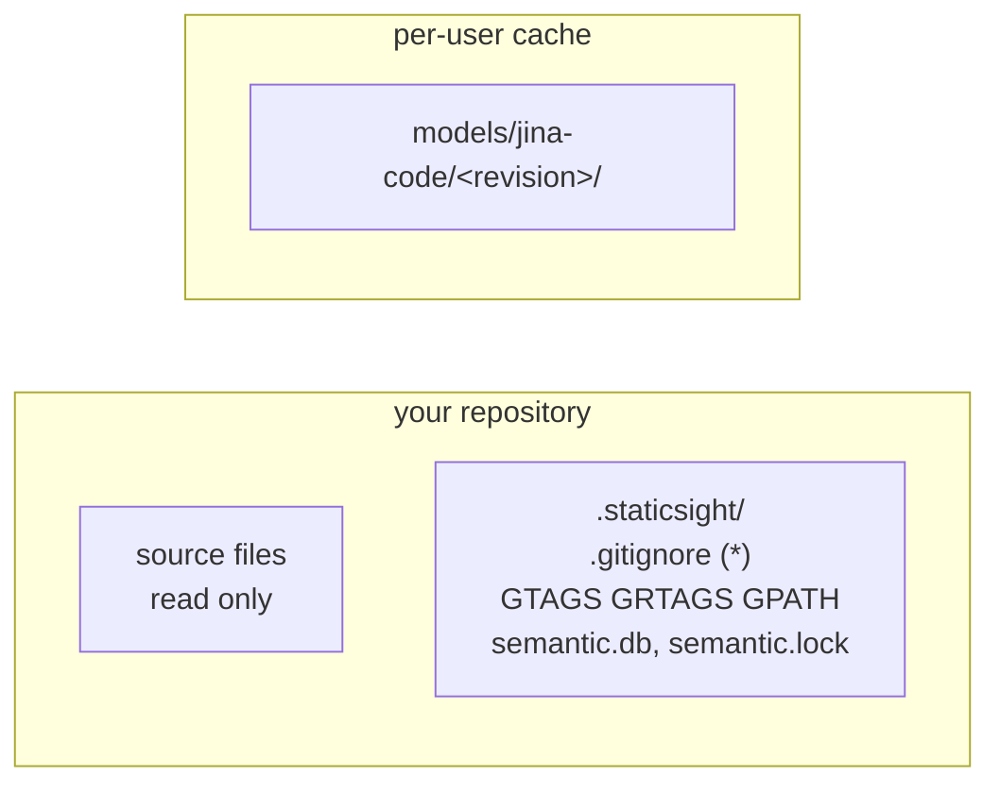

<!-- nav:top -->
📚 [Documentation](../README.md) › 📖 [The book](00-preface.md) › **Chapter 4: Architecture**
<!-- /nav:top -->

# 4. Architecture

This chapter shows how StaticSight is put together: the layers inside one implementation, the files the two
implementations share, how a process starts, and where data lives.

## The repository at a glance

```text
StaticSight/
├── staticsight.py          # plain-Python launcher: install check, --install, dispatch
├── requirements*.txt       # pip dependencies (core, semantic)
├── shared/                 # the single source of truth for both implementations
│   ├── tool-spec.json      # tool names, parameters, descriptions, server instructions
│   ├── prompts/            # the review_cpp_changes MCP prompt
│   ├── semantic/           # model manifest (pinned, sha256), SQLite schema, language rules
│   ├── fixtures/           # the test C++ repository, as data, with planted bugs
│   └── golden/             # expected output of every test case
├── staticsight-py/         # Python implementation (FastMCP)
├── staticsight-ts/         # TypeScript implementation (@modelcontextprotocol/sdk)
├── scripts/                # opt-in engine installers; semantic_query.py (learning script)
├── .github/                # Copilot skill and instruction; CI workflow
├── pipelines/              # Azure DevOps CI
└── docs/                   # this documentation
```

## Layers

Inside each implementation, code is arranged in layers. Each layer may only use the layers below it.



**platform/** is the only place that knows which OS it is running on: how to find an executable, start and kill a
process tree, normalise paths, compare file names (case-insensitive on Windows), and where the per-user cache is. A
test in both suites fails if OS checks (`sys.platform`, `process.platform`, …) or process spawning appear anywhere
else. Chapter 8 goes deeper.

**engines/** holds one adapter per external tool. An adapter builds the argument list, runs the command through the
platform layer, parses the JSON or XML output, and returns typed records with `/` paths. It also probes capabilities:
versions, and whether ctags supports JSON.

**semantic/** implements semantic search on top of the engines: which files to index, how to cut them into chunks, the
SQLite index with its freshness policy, and ranking.

**tools/** holds the 16 tools. They combine records from engines, apply the analysis (enclosing scopes, lock
inference, leak paths, classification of call sites) and render Markdown. They never start processes or look at the OS.

**Entry points** connect the tools to the world: the MCP server, the command line and the doctor.

## One contract, two implementations

The Python implementation (`staticsight-py/src/staticsight/`) and the TypeScript implementation
(`staticsight-ts/src/`) have the same layers and the same file names (in each language's style: `graph_gtags.py` and
`graphGtags.ts`). What keeps them identical is the **shared/** folder:

- `tool-spec.json`: the tool names, parameter names, types, defaults and descriptions, and the server instructions.
  A test checks the Python function signatures and docstrings against it; the TypeScript server builds its schemas from it.
- `prompts/review_cpp_changes.md`: the MCP prompt text.
- `semantic/`: the model manifest, the SQLite schema and the language rules. Either implementation can build the
  semantic index and either can read it.
- `fixtures/` and `golden/`: the test repository and the expected output for 40 cases. Both test suites compare their
  output with the same golden files, byte for byte (Chapter 9).

## How a process starts



`staticsight.py` uses only the standard library, so it can always explain what is missing. It then adds
`staticsight-py/src` to Python's import path and hands over to `staticsight.server.main`.

When the MCP server starts, it:
1. reads `tool-spec.json` and registers each tool with its description and annotations, wrapped in `safe_tool`;
2. registers the `review_cpp_changes` prompt;
3. after the handshake, starts GNU Global indexing in the background.

`safe_tool` is the single place that enforces two principles for every tool: errors become Markdown cards (never
exceptions), and output is cut to the budget.

## Choosing the workspace

Every tool works on one repository, the *workspace*. It is chosen in this order:

1. `--repo PATH` on the command line (turned into `WORKSPACE_ROOT` by the launcher);
2. the `WORKSPACE_ROOT` environment variable;
3. the nearest folder at or above the current folder that contains `.staticsight/` or `.git`.

All file arguments are resolved against the workspace and must stay inside it.

## Where data lives



- **Per repository, in `<repo>/.staticsight/`:** the GNU Global database and the semantic index. The folder's own
  `.gitignore` contains `*`, so git ignores everything in it (including the `.gitignore` itself) without editing your
  `.gitignore`. Each clone or worktree has its own indexes, which matches how branches differ. Deleting the folder is safe.
- **Per user:** the embedding model, downloaded once and shared by all repositories and both implementations
  (`~/.cache/staticsight/models`, `%LOCALAPPDATA%\staticsight\models`).
- **Fallbacks:** `STATICSIGHT_DATA_DIR=cache` stores per-repository data in the per-user cache instead; a read-only
  repository, or a folder that is not a git repository and was not chosen explicitly, uses it automatically. `doctor` and `index status` print the location and the reason.

## Why this shape

- **Layers make the OS a detail.** Because only `platform/` knows the OS, the rest can be tested once and behaves the
  same everywhere.
- **Adapters make engines replaceable.** Tools depend on records, not on command output formats. The ripgrep fallback
  for callers reuses the same records as GNU Global.
- **The shared contract makes two implementations cheap to keep in sync.** A change to a description is made once. A
  change to behaviour is checked by the goldens in both languages.
- **The command line reuses the MCP path.** `staticsight tool …` calls the same function through the same
  `safe_tool`, so what you see in a terminal is exactly what the agent receives.

---

<!-- nav:bottom -->
| ⬅️ [The engines](03-the-engines.md) | 📚 [Documentation](../README.md) | [A review, step by step](05-a-review-step-by-step.md) ➡️ |
|:---|:---:|---:|
<!-- /nav:bottom -->
