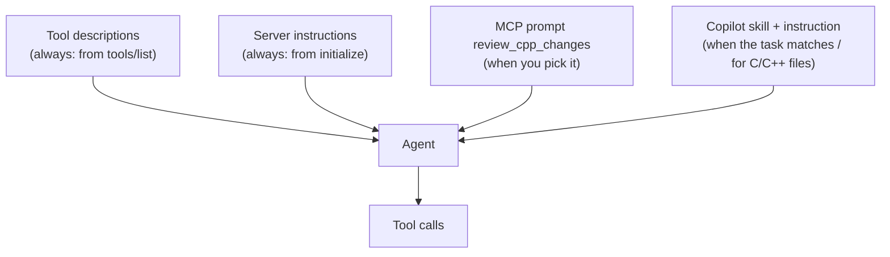

<!-- nav:top -->
📚 [Documentation](../README.md) › 📖 [The book](00-preface.md) › **Chapter 10: Using it with AI**
<!-- /nav:top -->

# 10. Using it with AI

StaticSight provides evidence; an AI agent turns it into a review. This chapter explains how the agent learns to use
the tools well, what you can ask, and how to get the best reviews.

## Three layers of guidance

An agent decides which tool to call from text it has in its context. StaticSight supplies that text at three levels.



**Tool descriptions** (`shared/tool-spec.json`) are always visible. Each says what the tool returns and **when to use
it**, in the words a user might say: "START HERE for 'review my changes' / 'what could break?'", "Use whenever a
struct/class gains, loses, reorders or resizes a member", "Use when you know WHAT the code does but not what it is
called". Good descriptions are the main reason agents pick the right tool without being told.

**Server instructions** are a short briefing sent in the handshake: what StaticSight is, to start with
`review_changes`, that results carry `file:line` references to cite, and that results marked heuristic must be verified.

**The MCP prompt** `review_cpp_changes(focus?)` is a ready-made review workflow for clients that support MCP prompts.
It walks through the tools in order, lists small but costly C++ issues to check (resource pairing, lock scope, ignored
errors, ABI and wire layout, macros, integer width, object lifetime), and defines the report format. `focus` adds
"Pay special attention to: …".

**The Copilot skill and instruction** in `.github/`:
- `skills/staticsight-cpp-review/SKILL.md` is loaded when a task matches its description (reviewing C/C++ changes,
  "what could break?", searching by intent). It contains the workflow, a table of which tool to call for each kind of
  change, how to read the markers, when to refresh the semantic index, and the report format: Blocker, Major, Minor
  and Nit, each with evidence, a fix, and a final verdict.
- `instructions/staticsight-cpp.instructions.md` applies to every C/C++ file (`applyTo`): prefer StaticSight evidence
  over guessing; check callers, layout and includes before editing; audit after editing.

To use them in your C++ repository, copy them to the same paths there, or install the skill for your user:

```text
cp -r $SS_HOME/.github/skills $SS_HOME/.github/instructions /path/to/cpp/repo/.github/
mkdir -p ~/.copilot/skills && cp -r $SS_HOME/.github/skills/staticsight-cpp-review ~/.copilot/skills/
```

In Copilot CLI, `/mcp` shows the server and its tools, and `/skills` shows the skill.

## What to ask

You don't need to name tools. Some requests and what an agent typically calls:

| You ask | The agent typically calls |
|---|---|
| "Review my changes. What did I miss, and could anything break?" | `review_changes`, then drill-downs |
| "Review only my last commit." | `review_changes(base_ref="HEAD~1")` |
| "Review the changes under `src/net`." | `get_diff_scopes(path_glob="src/net/*")`, then per-item tools |
| "I'm adding a field to `Packet`. What breaks?" | `track_struct_risks("Packet")`, `get_include_blast_radius("packet.hpp")` |
| "Who calls `process_packet`, and do they handle its errors?" | `get_upstream_callers("process_packet")` |
| "Show me just the logic paths of `Router::process_packet`." | `get_branch_skeleton(...)` |
| "Is `route_count` thread-safe?" | `track_state_mutations("route_count")` |
| "Can these locks deadlock?" / "Why does this hang?" | `track_lock_order()` or `track_lock_order(symbol="stats_mutex")` |
| "What does `zero_copy_allocate` require from its callers?" | `get_symbol_contract("zero_copy_allocate")` |
| "Where do we retry failed network calls?" | `semantic_search("retry failed network calls")` |
| "Is there code elsewhere that looks like `wal_append`?" | `find_similar_code("src/storage/wal.cpp", 5)` |
| "Caller results look incomplete. Why?" | `get_index_status` |
| "I just pulled. Refresh the search index." | `refresh_semantic_index()` |

## Getting better reviews

- **Ask for evidence.** "Cite file:line for every finding" makes the agent lean on tool output rather than memory.
- **Ask for a verdict.** "End with blockers and a merge verdict" makes the result actionable.
- **Name the risk you care about.** "Focus on locking and error codes" (or the prompt's `focus`) steers the drill-downs.
- **Let it verify heuristics.** "Before reporting a race, check the callers" turns a ⚠️ into a confirmed finding or a
  dismissed one.
- **Keep the index fresh.** After a pull or a branch switch, "refresh the index first" avoids stale semantic results
  (small changes are refreshed automatically).

## Humans can use the same evidence

Everything the agent sees, you can see: `staticsight tool review_changes` in a terminal prints the same bundle. This
is useful to:
- check a surprising claim ("the agent says two callers ignore the result": run `tool get_upstream_callers`);
- review without an agent, or before asking one;
- paste the bundle into a pull request description, or run it in CI;
- replay an agent's exact call from its log with `--json`.

See the [command-line guide](../cli-guide.md).

## Privacy and cost

StaticSight runs locally and never sends code anywhere; the only network access is the one-time, opt-in model
download. What the agent sends to its language model is up to the agent and your settings, but StaticSight keeps
that small: concise Markdown within a budget, instead of whole files. In practice, a review with StaticSight usually
uses *less* context than an agent reading files on its own, while citing more.

---

<!-- nav:bottom -->
| ⬅️ [Trust and testing](09-trust-and-testing.md) | 📚 [Documentation](../README.md) | [Limits and roadmap](11-limits-and-roadmap.md) ➡️ |
|:---|:---:|---:|
<!-- /nav:bottom -->
