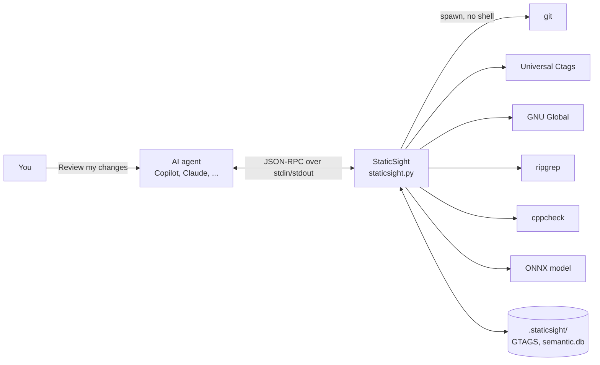
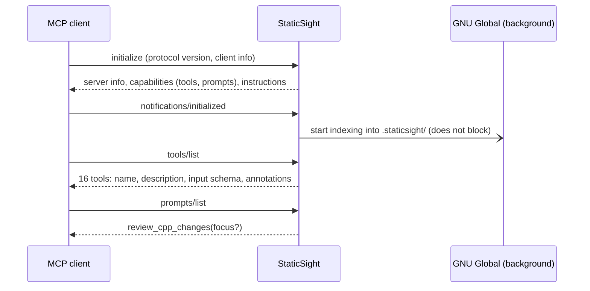
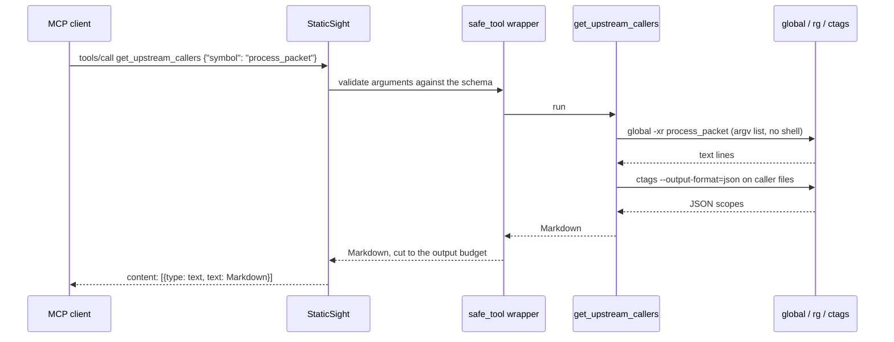
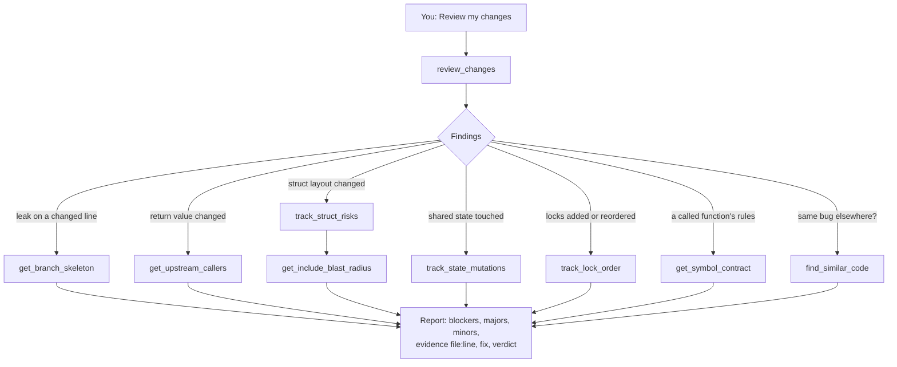

<!-- nav:top -->
📚 [Documentation](README.md) › **MCP guide**
<!-- /nav:top -->

# How an AI agent uses StaticSight (MCP)

StaticSight is a Model Context Protocol (MCP) server. This page explains, step by step, what happens between your
editor's agent (GitHub Copilot, Claude Code, Cursor, Windsurf) and StaticSight: how the server is started, how the
agent discovers the tools, what a tool call looks like on the wire, how errors and budgets work, and how the agent
decides which tool to call. The JSON below is a real exchange with `staticsight.py`, captured on the test repository.

<!-- nav:toc -->
**On this page:** [The big picture](#the-big-picture) · [1. The client starts the server](#1-the-client-starts-the-server) · [2. The handshake](#2-the-handshake) · [3. Tool discovery: what the agent sees](#3-tool-discovery-what-the-agent-sees) · [4. A tool call](#4-a-tool-call) · [5. When things go wrong](#5-when-things-go-wrong) · [6. How the agent chooses tools](#6-how-the-agent-chooses-tools) · [7. Watching and debugging](#7-watching-and-debugging) · [8. Two implementations, one contract](#8-two-implementations-one-contract) · [Next](#next)
<!-- /nav:toc -->

## The big picture



The agent does the reasoning; StaticSight provides facts with `file:line` evidence. StaticSight never calls a
language model and never sends code anywhere: everything runs locally.

## 1. The client starts the server

MCP clients start local servers as child processes and talk to them over **stdio**: JSON-RPC messages, one per line,
on the server's stdin and stdout. Your configuration tells the client which command to run:

```json
{
  "servers": {
    "staticsight": {
      "type": "stdio",
      "command": "python3",
      "args": ["/path/to/StaticSight/staticsight.py", "--repo", "${workspaceFolder}"]
    }
  }
}
```

`/path/to/StaticSight` is the full path of your StaticSight clone: the client only needs to know where
`staticsight.py` is. Configurations for Copilot CLI, Claude Code, Cursor and Windows are in [Getting started](getting-started.md#7-connect-your-ai-agent)..

When `staticsight.py` starts:
1. It checks the Python version and that the `mcp` package is importable. If not, it prints the exact install command
   on stderr and exits; clients show that text in their MCP log.
2. It picks the workspace: `--repo`, else `WORKSPACE_ROOT`, else the repository around the current folder.
3. It loads the tool catalogue from `shared/tool-spec.json` and starts listening.

stdout carries only protocol messages; all logs go to stderr, which clients show in their MCP output panel.

## 2. The handshake



The real `initialize` exchange (instructions shortened):

```text
>>> {"jsonrpc": "2.0", "id": 1, "method": "initialize", "params": {"protocolVersion": "2025-06-18", "capabilities": {}, "clientInfo": {"name": "demo", "version": "1"}}}
<<< {"jsonrpc": "2.0", "id": 1, "result": {"protocolVersion": "2025-06-18", "capabilities": {"experimental": {}, "prompts": {"listChanged": false}, "resources": {"subscribe": false, "listChanged": false}, "tools": {"listChanged": false}}, "serverInfo": {"name": "StaticSight", "version": "1.30.0"}, "instructions": "StaticSight gives you zero-compile, high-fidelity evidence about an uncompiled C++ repository (Universal Ctags, GNU Global, ripgrep, cppcheck, git). For a code …"}}
```

The **instructions** are a short, server-wide briefing that many clients add to the agent's context: what StaticSight
is and to start reviews with `review_changes`.

Right after the handshake, the server starts building or updating the GNU Global index **in the background**, so the
agent never waits for it. Graph tools that arrive before it is ready wait up to 2 seconds, then answer with the
ripgrep fallback and say so.

## 3. Tool discovery: what the agent sees

`tools/list` returns the 16 tools. One of them, as the agent receives it (description shortened):

```json
{"name": "get_upstream_callers",
 "description": "Finds every call site of a function/method across the repository (GNU Global reference index; falls back to ripgrep when…",
 "inputSchema": {"properties": {"symbol": {"title": "Symbol", "type": "string"},
                                "path_glob": {"default": "", "title": "Path Glob", "type": "string"}},
                 "required": ["symbol"], "title": "get_upstream_callersArguments", "type": "object"},
 "annotations": {"readOnlyHint": true, "destructiveHint": false, "idempotentHint": true, "openWorldHint": false}}
```

- The **description** is the most important field: the model reads it to decide *when* to call the tool. Every
  description says what the tool returns and when to use it ("Use after changing a function's signature, return
  values, error codes…"). They all come from `shared/tool-spec.json`, so the Python and TypeScript servers advertise
  exactly the same text.
- The **input schema** tells the client how to build arguments.
- The **annotations** tell the client the tool only reads (`readOnlyHint`), so many clients run it without asking
  for confirmation. The one exception is `refresh_semantic_index` (`readOnlyHint: false`): it writes, but only into
  `.staticsight/`.

You can see the same catalogue from a terminal: `staticsight tool --list` and `staticsight tool NAME --help`.

## 4. A tool call



The real exchange:

```text
>>> {"jsonrpc": "2.0", "id": 3, "method": "tools/call", "params": {"name": "get_upstream_callers", "arguments": {"symbol": "process_packet"}}}
<<< {"jsonrpc": "2.0", "id": 3, "result": {"content": [{"type": "text", "text": "### 📞 UPSTREAM CALLERS: `process_packet`\nFound 3 call sites in 2 files (source: GNU Global).\nReturns `int`; ⚠️ 2 caller(s) ignore the result — check they tolerate new error values.\n\n**`src/net/listener.cpp`**\n1. L9 in `Listener::on_socket_read` — result used\n   `int rc = router_->process_packet(&raw);`\n2. L17 in `Listener::dispatch_batch` — ⚠️ result ignored\n   `router_->process_packet(&batch[i]);`\n**`tests/test_router.cpp`**\n3. L6 in `test_drop_invalid` — ⚠️ result ignored\n   `r.process_packet(&dummy);`"}], "isError": false}}
```

Inside the server, every call goes through the same steps:

1. **Validate.** Arguments are checked against the schema. File paths are resolved and must stay inside the
   workspace (symlink escapes are refused). Symbols are validated as C++ identifiers before they reach a command line.
2. **Run engines.** Commands are started directly with an argument list, never through a shell, with a timeout
   (`STATICSIGHT_TIMEOUT`). User input goes after `--`. ctags and ripgrep produce JSON, cppcheck XML; only
   `global -x` output is parsed as text.
3. **Analyse.** The tool combines the engine outputs (for example: which function encloses each call, is the return
   value used) into typed records.
4. **Render.** The records become concise Markdown: headings, `file:line`, the evidence line, markers such as ⚠️,
   and a note when something is a heuristic.
5. **Budget.** Lists are capped (15 items by default, then "…and N more"), and the whole answer is cut to
   `STATICSIGHT_MAX_CHARS` (6,000 characters; 16,000 for `review_changes`), keeping code fences balanced. This keeps
   the agent's context small and focused.

## 5. When things go wrong

A tool never crashes the server. Missing engines, timeouts, deleted files, bad git refs and bad arguments come back
as a normal answer, a short Markdown **error card** with a hint:

```text
>>> {"jsonrpc": "2.0", "id": 4, "method": "tools/call", "params": {"name": "get_enclosing_scope", "arguments": {"file_path": "/etc/passwd", "target_line": 1}}}
<<< {"jsonrpc": "2.0", "id": 4, "result": {"content": [{"type": "text", "text": "### ❌ Invalid argument\n`/etc/passwd` is outside the workspace (WORKSPACE_ROOT).\n\n💡 Only files inside WORKSPACE_ROOT can be inspected."}], "isError": false}}
```

The card is sent as a normal result so the agent reads the hint and adapts (fix the path, try another tool, tell you
what to install), instead of seeing an opaque protocol failure. Degraded answers say how they were produced, for
example `(source: ripgrep fallback)` when GNU Global is missing.

## 6. How the agent chooses tools

The agent decides on its own, from four sources of guidance:

| Source | Where | What it says |
|---|---|---|
| Server instructions | `shared/tool-spec.json` → `server.instructions` | What StaticSight is; start reviews with `review_changes`. |
| Tool descriptions | `shared/tool-spec.json` → each tool | What each tool returns and when to use it. |
| MCP prompt | `review_cpp_changes(focus?)`, from `shared/prompts/review_cpp_changes.md` | A step-by-step review workflow and checklist, for clients that support prompts. |
| Copilot skill and instruction | `.github/skills/staticsight-cpp-review/SKILL.md`, `.github/instructions/staticsight-cpp.instructions.md` | How to review with StaticSight, how to read the markers, the report format; "prefer evidence over guessing" for C/C++ files. |

A typical review, as the agent chains it:



`review_changes` gives the overview within one budget; the individual tools give depth where the agent needs it.
Each answer ends with facts the agent can cite, so the final report points at exact lines.

## 7. Watching and debugging

| Goal | How |
|---|---|
| Is the server connected? | Copilot CLI: `/mcp`. VS Code: *MCP: List Servers*, then *Show Output* for the stderr log. |
| What exactly did the agent receive? | Run the same call in a terminal: `staticsight tool NAME --json '<arguments from the log>'`. The output is byte-identical. |
| Why are callers "ripgrep fallback"? | `staticsight tool get_index_status`: GNU Global is missing or still indexing. |
| Engines missing after installing them? | Restart the editor: the server inherits the editor's `PATH`. |
| The server exits at once | Run the configured command in a terminal. Missing packages and a wrong Python version print the fix. |

To see raw protocol traffic, any MCP client works, including the official MCP Inspector
(`npx @modelcontextprotocol/inspector python3 $SS_HOME/staticsight.py --repo .`).

## 8. Two implementations, one contract

The Python server (FastMCP) and the TypeScript server (`@modelcontextprotocol/sdk`) read the same
`shared/tool-spec.json` and produce byte-identical Markdown, enforced by shared golden tests on Linux and Windows.
Configure either one; the agent cannot tell the difference. They also share the `.staticsight/` data folder.

## Next

- [MCP tool reference](MCP_TOOLS.md): every tool's parameters, method and output.
- [Raw commands](COMMANDS.md): every engine command StaticSight runs.
- [Semantic search MCP flow](semantic-search/mcp-flow.md): what happens inside `semantic_search`.
- [The book](book/00-preface.md): the design, chapter by chapter.

---

<!-- nav:bottom -->
| ⬅️ [Command-line guide](cli-guide.md) | 📚 [Documentation](README.md) | [Semantic search](semantic-search/README.md) ➡️ |
|:---|:---:|---:|
<!-- /nav:bottom -->
