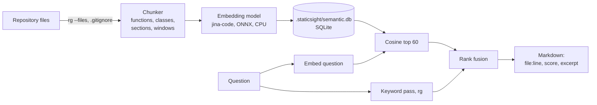

<!-- nav:top -->
📚 [Documentation](../README.md) › **Semantic search**
<!-- /nav:top -->

# Semantic search

StaticSight can search a repository by **meaning**:
- "where do we retry failed connections?"
- "code that writes the registry key"
- "the function that parses the packet header"

You do not need exact names, a compile or network access (after a one-time model download). It covers **every text file
in the repository**: C/C++, C#, Python, scripts, docs and configs.

## When to use it (and when not)

| You know… | Use |
|---|---|
| the exact name (`process_packet`, `OpenSCManagerW`) | `get_symbol_definition`, `get_upstream_callers`, or plain `rg` |
| **what the code does**, not what it is called | **`semantic_search`** |
| one function, and want its twins elsewhere ("does this bug exist twice?") | **`find_similar_code`** |
| a diff, and want everything a reviewer needs | `review_changes` (it also lists near-duplicates of changed functions) |

Semantic search finds *candidates*. The review tools then prove things about them: who calls them, whether they
leak, whether they are locked. Results always carry `file:line`, a score and an excerpt, so the agent (or you) can check them.

## The pages in this folder

| Page | Read it when you want to |
|---|---|
| [manual-guide.md](manual-guide.md) | use it yourself from a terminal: install, download the model, build, search, refresh, troubleshoot |
| [mcp-flow.md](mcp-flow.md) | understand what happens when Copilot calls `semantic_search`: the freshness check, the refresh policy, ranking |
| [internals.md](internals.md) | know how it is built: chunking, the model, hybrid ranking, storage, configuration, performance |
| [experiments.md](experiments.md) | learn by doing: the standalone `semantic_query.py --explain` script, SQLite queries, things to try |

## In one picture

The index lives in `<repo>/.staticsight/`, a folder that git ignores (it holds its own `.gitignore`). Every clone or
worktree has its own index, and deleting the folder is always safe.

---

<!-- nav:bottom -->
| ⬅️ [MCP guide](../mcp-guide.md) | 📚 [Documentation](../README.md) | [Manual guide](manual-guide.md) ➡️ |
|:---|:---:|---:|
<!-- /nav:bottom -->
