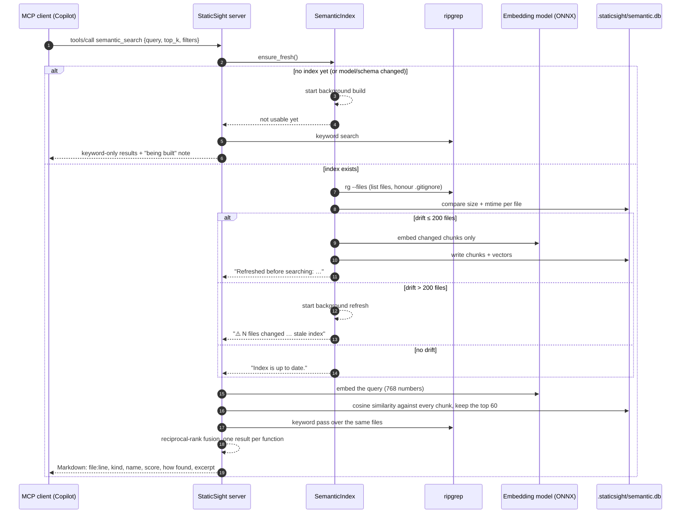

<!-- nav:top -->
📚 [Documentation](../README.md) › [Semantic search](README.md) › **MCP flow**
<!-- /nav:top -->

# What happens when an agent calls `semantic_search`

This page follows one `semantic_search` call from the MCP client to the Markdown answer. It explains the freshness
policy (why there are no git hooks), how the index is refreshed, and how results are ranked. The same steps run for
the command line (`staticsight search`), since the CLI calls the same functions.

<!-- nav:toc -->
**On this page:** [The sequence](#the-sequence) · [Step by step](#step-by-step) · [The other semantic tools](#the-other-semantic-tools) · [How the agent knows when to call it](#how-the-agent-knows-when-to-call-it)
<!-- /nav:toc -->

## The sequence



## Step by step

### 1. The call

The client sends a JSON-RPC `tools/call` request. The arguments are validated against the schema from
`shared/tool-spec.json`:

```json
{"name": "semantic_search", "arguments": {"query": "where do we retry failed connections", "top_k": 3}}
```

An empty query is rejected with a Markdown error card (never a crash). `top_k` is clamped to 1-30.

### 2. Is the index fresh? (`ensure_fresh`)

StaticSight never installs git hooks and never watches files. Instead, **every semantic call checks for drift**:

1. List the files the index should contain: `rg --files` with `.gitignore`, `.staticsightignore` and the built-in excludes.
2. Compare each file's size and modification time with what the index recorded. This takes milliseconds, even for
   thousands of files. Only files whose timestamp changed are read and hashed.
3. Decide:

| Situation | What happens | What the answer says |
|---|---|---|
| No index yet, or the model/schema/chunker changed | A full build starts **in the background**. This call answers with keyword-only results. | `The semantic index is being built for the first time in the background …` |
| Up to 200 files changed (`STATICSIGHT_SEMANTIC_AUTO_REFRESH_FILES`) | Those files are re-embedded **now**, then the query runs. | `Refreshed before searching: re-indexed 1 changed file(s) …` |
| More than 200 files changed (e.g. after a big `git pull`) | A refresh starts **in the background**. The query runs on the current index. | `⚠️ 1234 files changed since the last refresh; a background refresh has started …` |
| Nothing changed | Query runs immediately. | `Index is up to date.` |
| `STATICSIGHT_SEMANTIC_AUTO_REFRESH=0` | Never refreshes by itself. | `⚠️ N file(s) changed … (automatic refresh disabled)` |

The note is always in the answer, so the agent knows how fresh its evidence is. A real answer after one file changed:

```text
Index: 21 files, 48 chunks (jina-code@516f4baf13dec4ddddda8631e019b5737c8bc250). Refreshed before searching: re-indexed 1 changed file(s), removed 0; embedded 0 new chunk(s).
```

### 3. Refreshing (only what changed)

For each changed file: chunk it again (functions, classes, sections, windows), compute each chunk's text hash, and
embed **only chunks whose hash is new**. Moved or unchanged code keeps its vector. A lock file
(`.staticsight/semantic.lock`, with a heartbeat) stops two processes (for example the MCP server and a terminal) from
refreshing the same index at the same time. Background builds embed code files first, so the partial index is
useful early; `get_index_status` shows progress and an ETA.

### 4. Semantic ranking

The query is embedded with the same model as the chunks (768 numbers, length 1). Every chunk vector is compared with
it (a single matrix-vector product: about 15 ms for 64,000 chunks), and the 60 best are kept.

### 5. Keyword ranking

Words from the query (minus stop words) are searched with ripgrep over the same files. This keeps exact identifiers
such as `OpenSCManagerW` from being missed when the model does not know them.

### 6. Fusion and grouping

The two ranked lists are fused with reciprocal-rank fusion: each result gets `1/(60 + rank)` from the semantic list and
`0.5/(60 + rank)` from the keyword list. Results are then grouped so that one function appears once, even when it was
split into several chunks. Each result says how it was found: `semantic`, `keyword` or `semantic+keyword`.

### 7. The answer

The Markdown answer has a title, the index line with the freshness note, the results (location, kind and name,
language, score, how found, a short excerpt), and a closing reminder that the results are evidence to verify:

````text
### 🔎 SEMANTIC SEARCH: "where do we retry failed connections"
Index: 21 files, 48 chunks (jina-code@516f4baf13dec4ddddda8631e019b5737c8bc250). Refreshed before searching: re-indexed 1 changed file(s), removed 0; embedded 0 new chunk(s).
1. `tools/retry.py:6-7` — function `retry_with_backoff` (python) · 0.67 · semantic+keyword
   ```python
   6 | def retry_with_backoff(call, attempts=5, base_delay=0.5):
   7 |     """Call `call()` until it succeeds, sleeping exponentially longer after each ConnectionError."""
   ```
2. `docs/design.md:5-8` — section `Retry policy` (markdown) · 0.59 · semantic+keyword
   ...
3. `tools/router.yaml:1-5` — window (yaml) · 0.49 · semantic+keyword
   ...

_Scores are cosine similarity from the local embedding model (higher is closer); results are ranked by fusing semantic and keyword matches. Verify the code before asserting._
````

Like every tool, the answer is capped (`STATICSIGHT_MAX_CHARS`, 6,000 characters by default) with code fences kept balanced.

## The other semantic tools

| Tool | What differs |
|---|---|
| `find_similar_code(file_path, start_line, end_line?, top_k?)` | The "query" is the code region itself (the enclosing function when only a line is given). No keyword pass. Results from the same region are excluded; ≥ 0.92 is labelled *near-duplicate*, ≥ 0.85 *very similar*. |
| `refresh_semantic_index(full?)` | Runs step 3 on purpose. Small refreshes finish before returning; large ones continue in the background. The only tool that writes, and only into `.staticsight/`. |
| `get_index_status()` | Reports state, progress, languages, model and where the database is (and why). |
| `review_changes` | Calls `find_similar_code` internally for changed functions and adds "Similar code elsewhere" when it finds near-duplicates (≥ 0.85). |

## How the agent knows when to call it

The client learns about the tools from `tools/list`. The descriptions (from `shared/tool-spec.json`) say *when* to use
each one, for example "Use when you know WHAT the code does but not what it is called". The Copilot skill in
`.github/skills/staticsight-cpp-review/SKILL.md` adds guidance such as "after a git pull, call
`refresh_semantic_index`". See the [MCP guide](../mcp-guide.md) for the whole protocol.

---

<!-- nav:bottom -->
| ⬅️ [Manual guide](manual-guide.md) | 📚 [Documentation](../README.md) | [Internals](internals.md) ➡️ |
|:---|:---:|---:|
<!-- /nav:bottom -->
